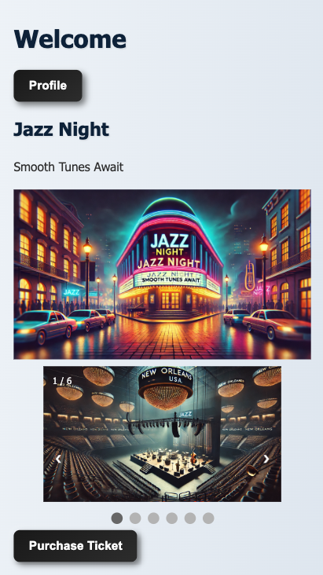
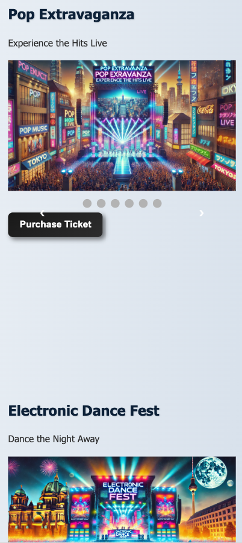
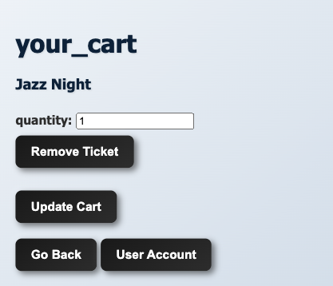
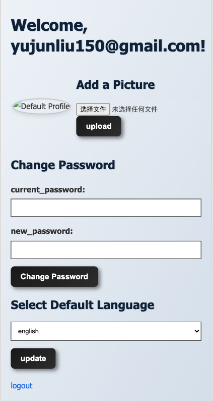
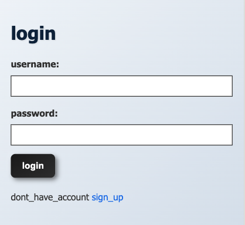

# This is a app that outruns TicketMaster !

## Preview







## Structure: 

```
TicketMeister/
├── app.js
├── package.json
├── middleware/
│   └── auth.js
├── public/
│   ├── Stylesheets/
│   │   └── style.css/
│   ├── images/
│   │   ├── venue2/
│   │   ├── venue3/
│   │   ├── venue4/
│   │   ├── venue5/
│   │   └── venue6/
│   └── scripts/
│   │   └── slider.js/
├── routes/
│   ├── index.js
│   ├── add-picture.js
│   ├── change-password.js
│   ├── select-language.js
│   ├── auth.js
│   ├── cart.js
│   ├── users.js
│   └── venues.js
├── views/
│   ├── signup.ejs
│   ├── login.ejs
│   ├── cart.ejs
│   ├── user.ejs
│   └── venues.ejs
├── locales/
│   ├── en.json
│   ├── it.json
│   ├── fr.json
│   └── es.json
├── data/
│   ├── users.json
│   └── venues.json
└── README.md
```
### INTRODUCTION

```
Basic flow: 

User -> Choose Venue -> Checkout
            |              |
            V              V
            Profile(optional)
```

- User: so, this app going to have login/signup feature, and user.json stores it, which means no backend.

- Add to cart: after login/signup, there is venues page showing options for venues with some css 

- Cart: you can always update your ticket numbers in this page or go back to add more

- Profile: there is a profile page that manages your profile information where you can change password/add a picture/reselect language

### INSTALLATION

```
npm install
```

### RUN

```
npm start
```

### Author: Yujun Liu